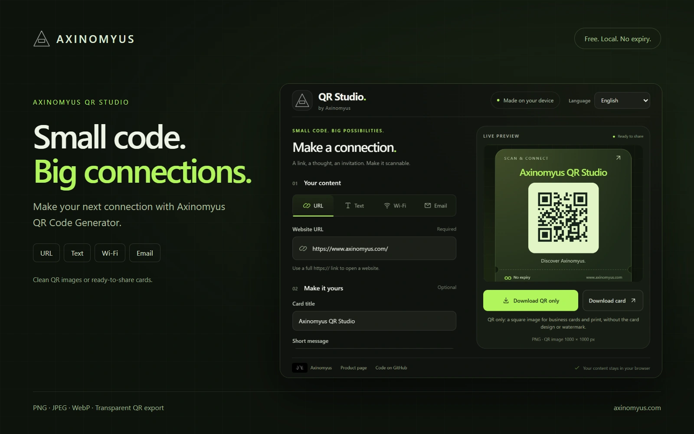
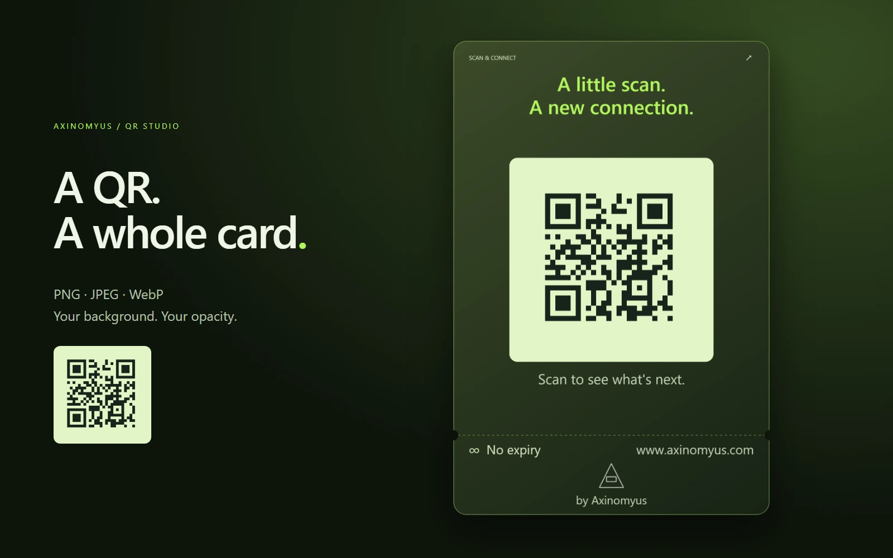
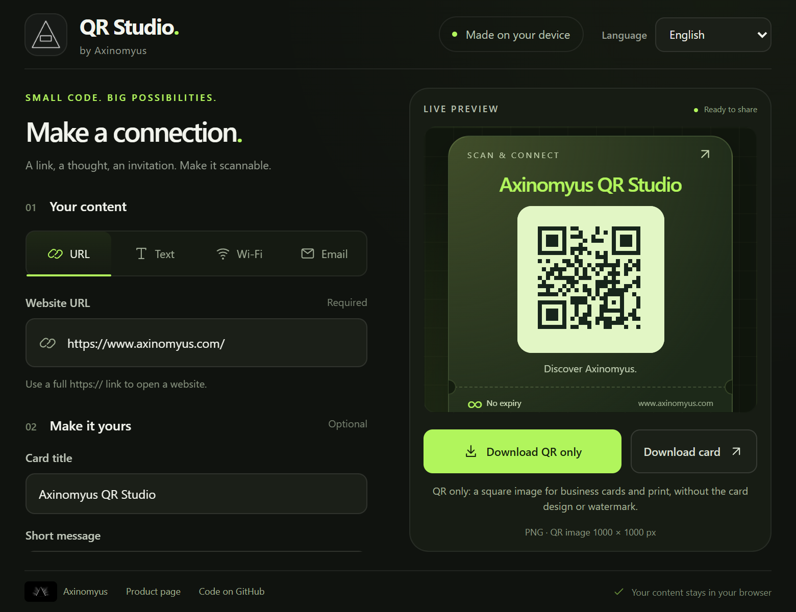
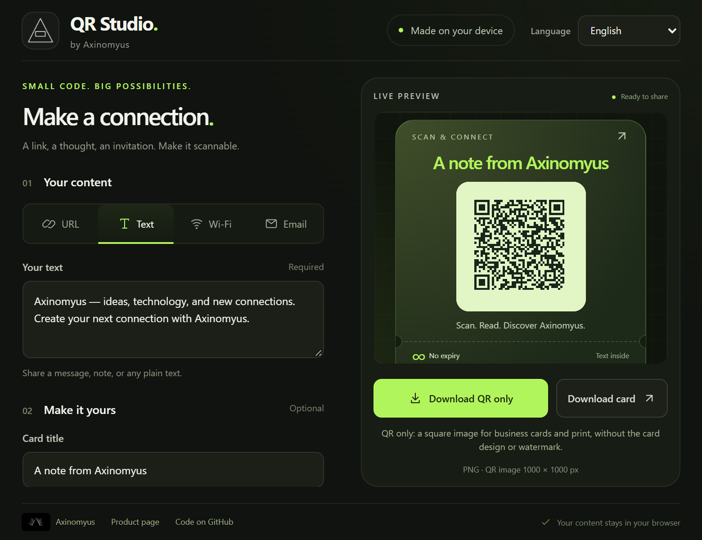
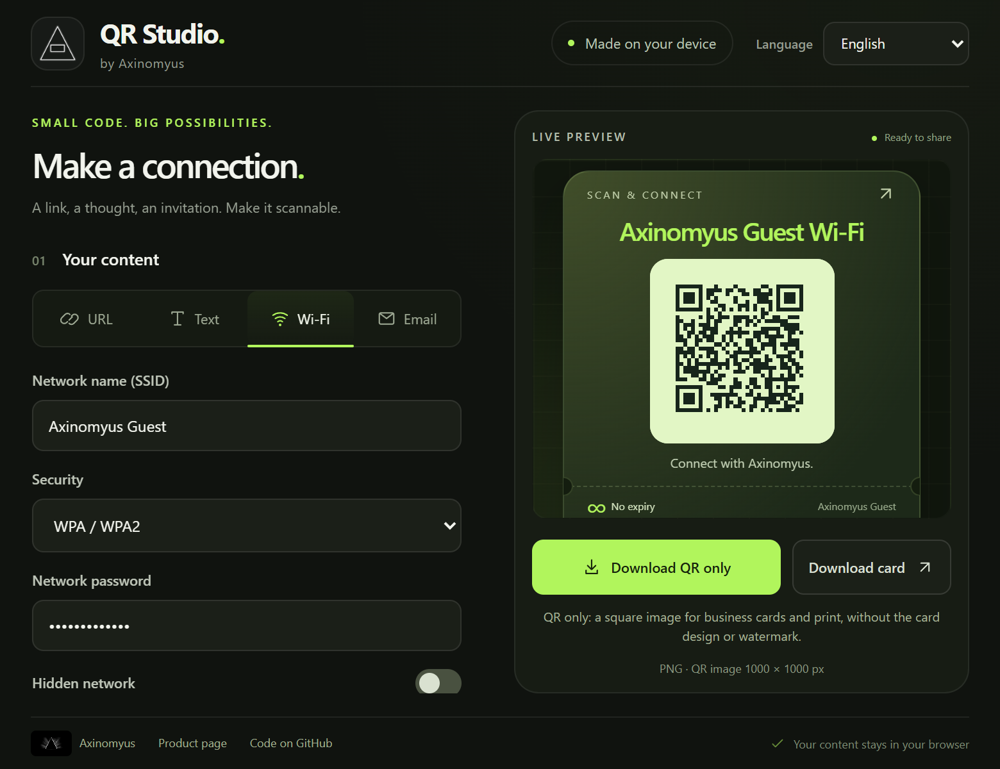
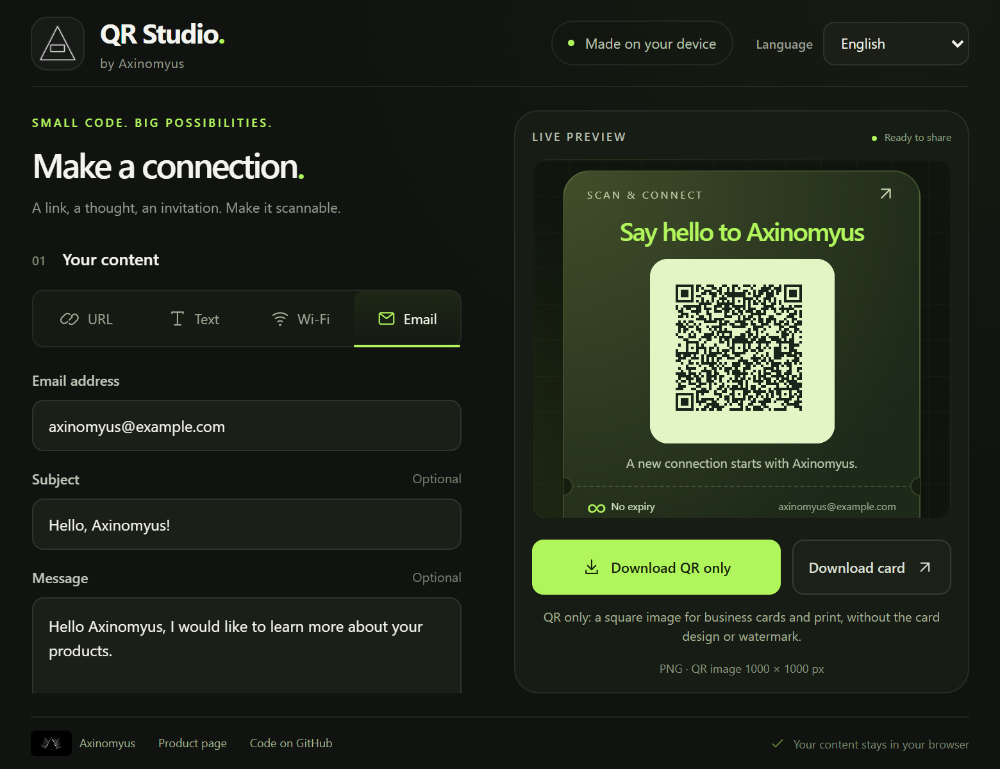
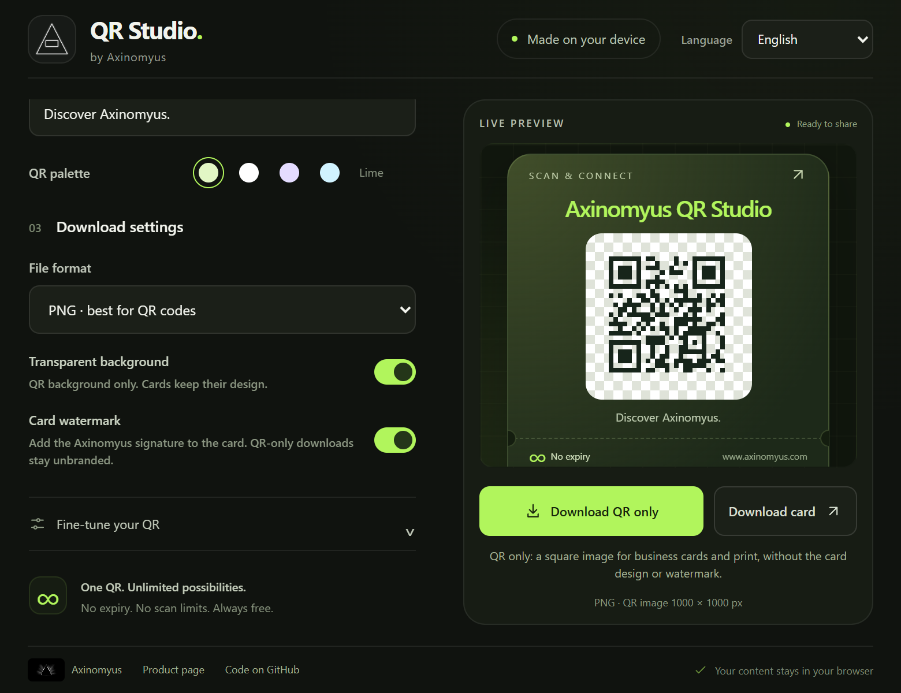

# QR Code Generator by Axinomyus

Create QR codes for websites, text, Wi-Fi networks, and email drafts. Customize the colors, then download a clean QR image for your own design or a ready-to-share card.

[Chrome Web Store](https://chromewebstore.google.com/detail/idmopdehblodmajcpfopappenmddidoa) · [Product page](https://www.axinomyus.com/products/qr-code-generator-extension) · [Axinomyus](https://www.axinomyus.com/)

## Features

- **Four content types:** URL, text, Wi-Fi, and email, with a dedicated form for each.
- **Unlimited scans, no expiry:** static QR codes contain your content directly, without a hosted redirect service or subscription.
- **Two download options:** an unbranded, square QR image or a designed card with a title and short message.
- **PNG, JPEG, and WebP:** use transparent PNG or WebP QR images in business cards, packaging, posters, and other layouts. JPEG uses a solid background.
- **Customization:** color presets, custom colors, opacity, extra margin, error correction, and QR sizes from 256 to 2048 pixels.
- **Optional card watermark:** show or hide the Axinomyus signature on card downloads. QR-only downloads never include the watermark.
- **Five languages:** Türkçe, English, Русский, Українська, and Deutsch. The interface remembers your selected language.
- **Local generation:** QR content is processed in your browser. No account or server is needed to generate or download a code.

## Choose your content

| Type | Enter | What the QR contains |
| --- | --- | --- |
| URL | A full `https://` or `http://` website address | The website address, directly |
| Text | A message or note | Your text, including Unicode characters and line breaks |
| Wi-Fi | Network name, security, password, and optional hidden-network setting | A Wi-Fi configuration for WPA/WPA2, WEP, or an open network |
| Email | Recipient, optional subject, and optional message | A `mailto:` link that opens an email draft |

Switching tabs preserves the information entered in each form for the current session. A scanner's available actions depend on the device and scanning application.

## QR image or card?

**Download QR only** produces a square image containing the QR and its scanning margin. It has no card design, title, caption, or watermark. Use this when you are designing a business card or placing a code in an existing layout.

**Download card** includes the card design, your title and message, and an optional Axinomyus watermark. Its dimensions also depend on the card content. The transparency option applies to QR-only downloads; cards retain their designed background.

The sample [QR image](.github/images/qr-only.png) and [card](.github/images/qr-card.png) both encode `https://www.axinomyus.com/`.

## Get started

### Chrome extension

Install from the [Chrome Web Store](https://chromewebstore.google.com/detail/idmopdehblodmajcpfopappenmddidoa), then open QR Code Generator from the extensions menu.

The screenshots in this README show the source in this repository. The store package is released separately and may not yet include these changes.

### Load the source locally

1. Download or clone this repository.
2. Open `chrome://extensions` and enable **Developer mode**.
3. Select **Load unpacked** and choose the folder containing `manifest.json`.
4. Open the extension from the browser toolbar.

There is no installation or build step. To use the standalone interface, open `index.html` in a current Chromium-based browser. This also provides a larger workspace than the extension popup.

### Make your first QR

1. Choose **URL**, **Text**, **Wi-Fi**, or **Email**.
2. Fill in the corresponding content. The preview updates automatically.
3. Choose a palette or adjust the detailed QR settings.
4. Select PNG, JPEG, or WebP. Enable transparency for a PNG/WebP QR image if needed.
5. Download the QR alone, or add a title and message and download the card.
6. Scan the exported image before printing, especially after resizing it or placing it on a different background.

## Screenshots

<table>
    <tr>
        <td></td>
        <td></td>
    </tr>
    <tr>
        <td></td>
        <td></td>
    </tr>
</table>

The Wi-Fi and email screenshots use demonstration data. They do not provide access to a real Axinomyus network or represent a contact address.

## Privacy and limits

- QR generation and image export do not send your content to an API. Opening an external website link is a separate action.
- Only the language preference is saved in local storage. Form contents, Wi-Fi credentials, and QR history are not persisted by the app.
- A Wi-Fi QR contains the entered password when the network requires one. Share that QR only with people who should be able to join the network.
- Static QR codes do not expire and have no scan counter. A website or other destination encoded in a QR still needs to remain available.
- An exported QR cannot be edited remotely. Generate a new code if the encoded information changes.
- Each QR has a finite data capacity. The app checks the UTF-8 byte length against the selected error correction level and reports content that is too long.

## Project structure

| File | Purpose |
| --- | --- |
| `index.html` / `style.css` | Extension and standalone interface |
| `content.js` | Content tabs, validation, Wi-Fi and email encoding |
| `script.js` | QR preview, appearance, and image downloads |
| `localization.js` | Five-language interface and language preference |
| `manifest.json` | Chrome Manifest V3 extension configuration |
| `src/vendor/qrious.js` | Bundled QRious encoder |
| `.github/images/` | Only the screenshots and examples referenced in this README |

The extension PNG icons are exported from [the editable vector source](img/qr-studio-logo.svg). Store artwork and publishing materials are maintained outside this source repository.

## License and credits

The repository's original [MIT license](LICENSE) is retained. Bundled third-party files retain their own license notices; the QRious distribution in `src/vendor/` identifies GPL-3.0-or-later in its header. Its full license text is included in [src/vendor/LICENSE.qrious.txt](src/vendor/LICENSE.qrious.txt).

Created by [Axinomyus](https://www.axinomyus.com/). [Source and issues](https://github.com/Axinomyus/QR-Code-Generator).
